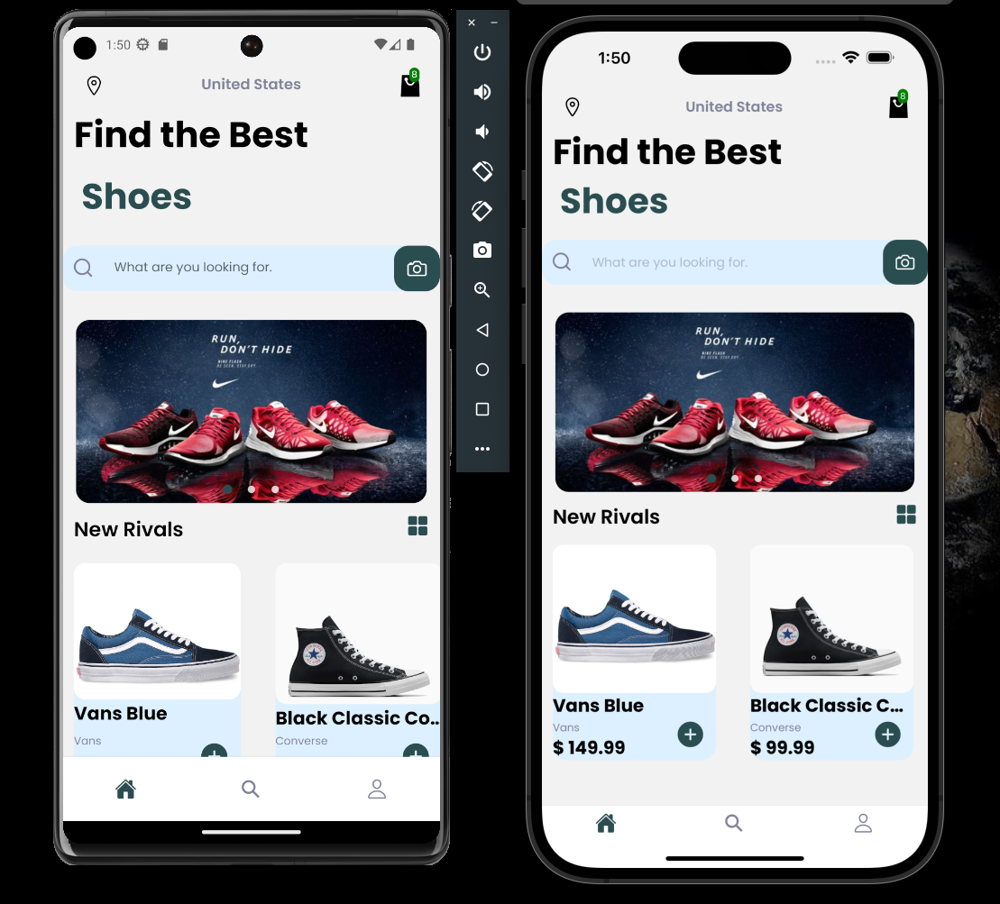

# Shoes Ecommerce App

## Welcome to my Shoes Application made with React Native. 

This Mobile Application Shoes Ecommerce was created using Reat Native app building that consist of NodeJS Backend using Mongodb, separate Stripe Node Server with (strype payments) and React Native Frontend 

The App consist in an inventory of different brands of shoes. The user needs to create an log-in that enables them the option to add to the cart and favorites and make changes in the account. The application has a search window that allows the user to search in the inventory using a keyword that can be in description, name and location. That will have a checkout option to place and order and make a payment using strype payments. 

Created by Eddy Gonzalez

